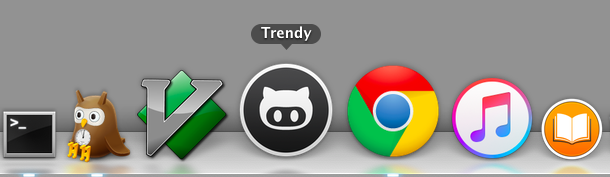
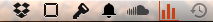
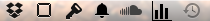
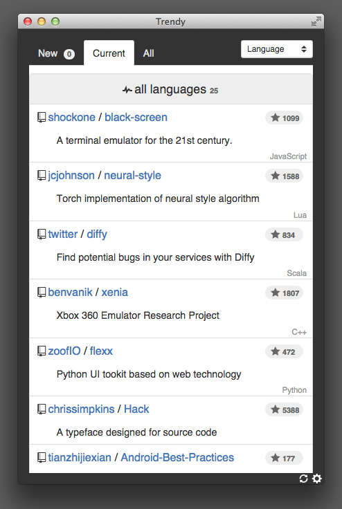

=====================

[Trendy](https://github.com/rhysd/Trendy) is a [GitHub Trending Repository](https://github.com/trending) viewer for trend-conscious people.  Trendy watches the GitHub trends and notifies the update to you.  The app can be integrated to menubar or used as isolated app.

## Features

- [x] Manage unread repositories.  Trendy remember you already checked the trending repository or not.
- [x] Current trending repositories of your favorite languages.
- [x] All past trending repositories of your favorite languages.
- [x] Cross platform (built on [Electron](https://github.com/atom/electron)).  For OS X, Linux and Windows.
- [x] Menu bar integrated window or isolated window.
- [x] Embedded browser support
- [x] Language filters

## Installation and Prepare

__Note that now Trendy is heavily being developped.__

[Alpha release](https://github.com/rhysd/Trendy/releases) and [npm package](https://www.npmjs.com/package/trendy) are available.

If you download and unzip application release from GitHub, please click executable to start.

After clicking the app icon, the languages picker window will be launched.  You can choose favorite languages to watch their trend.  You can search by the name of languages incrementally in the window.  After finishing to pick up, push 'Go' button to start Trendy.
First, Trendy scrapes trending pages and calls GitHub API to get repositories' information.  This is because GitHub provide no API for GitHub trending repositories.
After a while, the result will be shown in the menu window.

Trendy does polling GitHub trending repositories per hour to update the trends and to notify it to you.

## Usage

### __'New'__ tab

In 'New' tab, the repositories firstly emerging as trending repository are shown.  You can mark them as read.  The repositories marked as read are removed from the 'New' tab.

### __'Current'__ tab

In 'Current' tab, the current GitHub trending repositories are shown.

### __'All'__ tab

In 'All' tab, the repositories which have ever emerged as trending repository are shown.

### Notification

| Notified menu bar | Normal menu bar |
| ----------------- | --------------- |
|  |  |

Trendy does polling GitHub trending repositories per hour.  When Trendy finds new comers to GitHub trending repositories, it notifies them by changing the color of menu bar icon.  When new repositories are registered as 'new', the icon will be red as above.

### __Embedded Browser__

By clicking links in the window, embedded browser slides in.  It shows mobile pages of the links.  You can go forward/back, open the page in external browser and close the embedded browser.

### __Language Filters and Options__

You can access to menu by clicking right above menu button.  The menu includes word search, language filters and options.  Language filters filter the repositories in the menu window by language.  Options can force to update the trends, show settings file by your favorite editor and exit Trendy.

### __Isolated Window__

Setting `mode` value to `"isolated"` in `config.json` enables isolated window (Path to `config.json` is described in next section).
Instead of menu window, Trendy main window shows up as isolated window.  Side menu, which is hidden in menu window, is always shown in isolated window mode.
In Windows environment, this isolated window is enabled by default because menubar window works only when task bar is put to bottom.

## Customization

### Config File

You can customize Trendy by modifying `config.json`.

| OS      | Path                                                |
| ------- | --------------------------------------------------- |
| OS X    | `~/Library/Application\ Support/Trendy/config.json` |
| Linux   | `~/.config/Trendy/config.json`                      |
| Windows | `%APPDATA%\Trendy\config.json`                      |

You can access this file by 'Settings' in side menu.

### Config Values

| Name        | Default     | Description                                         |
| ----------- | ----------- | --------------------------------------------------- |
| mode        | `'menubar'` | Window mode, `'menubar'` or `'isolated'`            |
| width       | `400`       | Window width                                        |
| height      | `400`       | Window height                                       |
| languages   | `[]`        | Languages to watch.  You can leave this value empty |
| icon\_color | `'black'`   | Menu icon color, `'black'` or `'white'`             |
| proxy       | `''`        | URL for proxy                                       |
| hot\_key    | `''`        | Hot key to toggle window.  Format is [here](https://github.com/atom/electron/blob/master/docs/api/accelerator.md) |

## License

Distributed under [the MIT License](LICENSE.txt).

